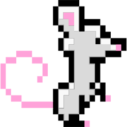
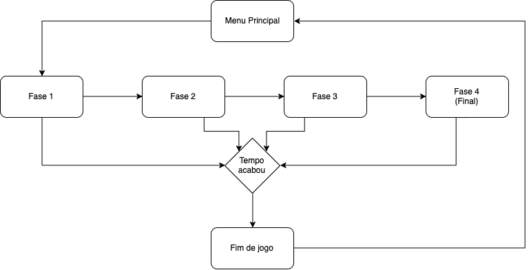

# <b>Maze Scape</b>
<i>Projeto acadêmico desenvolvido durante a disciplina Estágio 1, supervisionada pelo Professor Eduardo Mendes, na Universidade 7 de Setembro; com intuito de desenvolver um jogo em Lua, utilizando o kit de desenvolvimento de software: Corona SDK.</i>
## <b>Nome do jogo</b>
* Maze Scape

## <b>Gênero</b>
* Labirinto

## <b>Público alvo</b>
* 

## <b>Objetivo Geral</b>
* Completar do labirinto no menor tempo possível e encontrar o tão desejado pedaço de queijo.

## <b>Objetivo específico</b>
* Completar o labirinto, abrindo os cadeados e encontrando o queijo ao final. Para isso, o Mr. Mouse deve completar os desafios do labirinto antes do tempo acabar.

## <b>Enredo e Personagens</b>
* Mr. Mouse é um singelo ratinho que está em busca de encontrar o seu queijo na imensidão de uma cozinha, que parece mais um labirinto. Para isso, ele deverá contar com a sua agilidade e destreza para encontrar as chaves e abrir os cadeados das despensas, fazendo tudo no menor tempo possível para não ser pego.

## <b>Personagem Principal</b>
* Mr. Mouse
 

## <b>Inimigos</b>
* Não se aplica.

## <b>Interação do jogador</b>
O jogador irá movimentar o Mr. Mouse (ratinho) pelo labirinto, através do movimento de toque nas setas posicionadas em formato de <i>joystick</i>, indicando a direção que deve percorrer (cima, baixo, direita, esquerda).

## <b>Controles</b>
* Touch (Joystick)

## <b>Regras do jogo com sistema de pontuação</b>
* O jogador deverá coletar, a cada fase, a chave localizada no labirinto para abrir o cadeado. O mesmo, depois de aberto, levará para a próxima fase. <u>Ao coletar a chave</u>, o jogador ganhará <b>+10 pontos</b> e <u>ao passar de fase ganhará</u> <b>+20 pontos</b>.
* <b>Ao final do jogo, na última fase,</b> <u>não haverão chaves nem cadeados</u>. Haverá apenas uma faca e um garfo, dos quais deverão ser <b>ambos</b> coletados para que o jogo acabe ao chegar até o queijo. Ao coletar cada um dos utensílios, o jogador ganhará <b>+15 pontos</b>, totalizando <b>+30 pontos</b> máximo.

## <b>Sistema de vidas</b>
* Não há um sistema de vidas especificamente definido. Caso o tempo chegue a zero, o jogo acabará.

## <b>Sistema de pontos</b>
* O jogador começa com 0 pontos.
* Cada fase terá um período de tempo total específico, de acordo com o seu nível de dificuldade. O cálculo dos pontos do jogador será: <b><i>valorAbsoluto</i>[(Tempo restante/Tempo total)*100]</b>

* <b>Exemplo:</b> o tempo total da fase é de 30 segundos; o jogador completa a fase em 19 segundos, restando 11 segundos; o cálculo da pontuação será (11/30)*100, que resulta em 36,6666666667; o valor absoluto é 36. Logo, a pontuação daquela fase será 36 somado aos pontos acumulados na fase anterior.

## <b>Como o jogo acaba</b>
* O jogo acaba caso o tempo chega a zero.
* O jogo acaba ao completar todas as fases.

## <b>Diagrama de navegação do jogo</b>
